# Wazuh SIEM Security Monitoring Project

## Project Overview
I built this security monitoring lab to learn how organizations detect and respond to cyber threats. I deployed Wazuh SIEM (Security Information and Event Management) across two virtual machines — an Ubuntu server running the SIEM platform and a Windows 10 workstation being monitored. Then I created bash scripts to simulate attacks, monitor threats in real time, and generate security reports.

## Technologies I Used
- **Wazuh 4.9.2** — Open source SIEM platform  
- **Ubuntu Server** — Running the SIEM manager  
- **Windows 10** — Monitored endpoint  
- **Bash Scripting** — For automation and monitoring  
- **PowerShell** — For Windows configuration  
- **OpenSearch** — For data storage and search  
- **VirtualBox** — For running virtual machines  

---

## Project Screenshots

### Step 1: Installing the SIEM Platform
I started by installing Wazuh on Ubuntu Server with all its components.

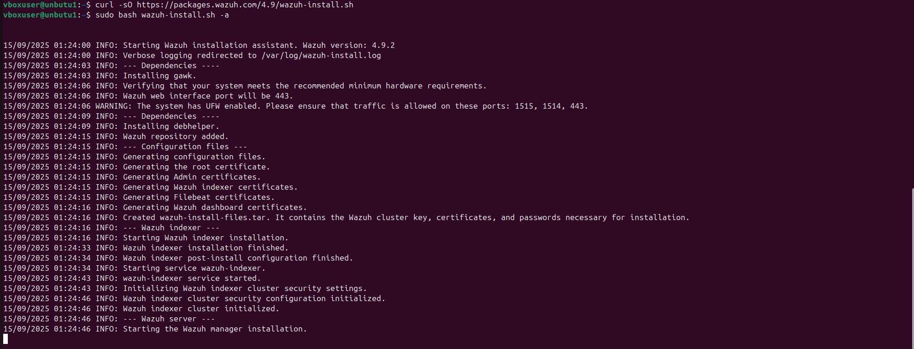  
*Running the Wazuh installation script — showing version 4.9.2 being installed*

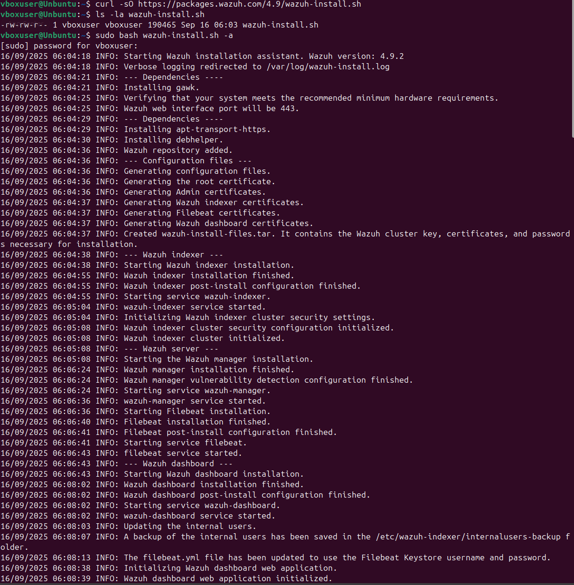  
*Wazuh components being configured — manager, indexer, and dashboard services starting up*

### Step 2: Accessing the Security Dashboard
After installation, I accessed the web dashboard to monitor security events.

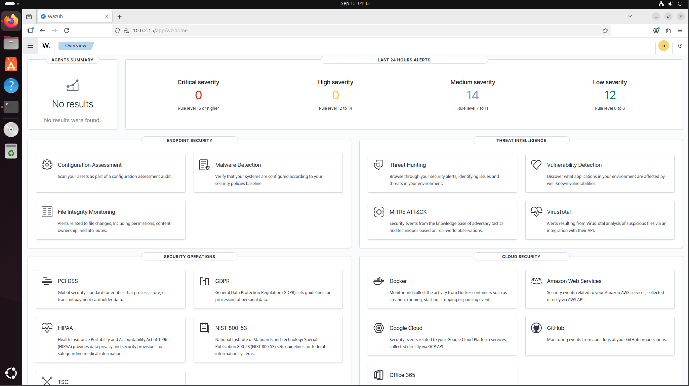  
*First login to Wazuh dashboard — showing 14 medium and 12 low severity alerts already captured*

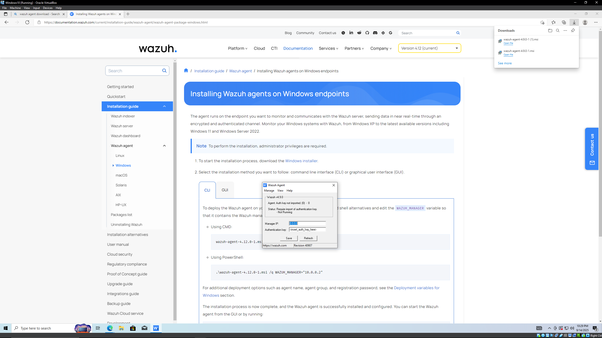  
*Reviewing the Windows agent installation guide in the Wazuh documentation*

### Step 3: System Growth and Monitoring
As the system ran, it started capturing more security events from both machines.

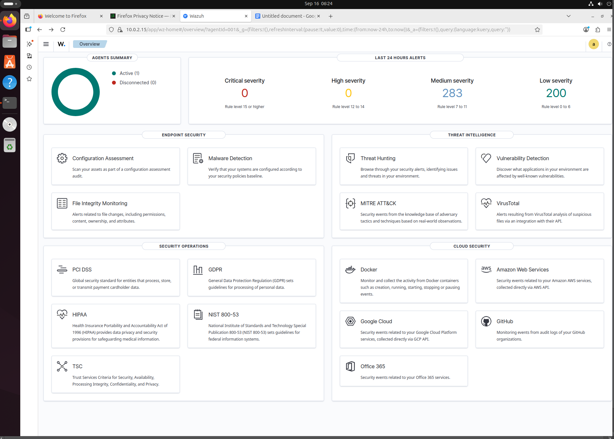  
*Dashboard after some time — now showing 283 medium and 200 low severity alerts*

### Step 4: Windows Agent Deployment
I installed the Wazuh agent on Windows 10 to monitor that system too.

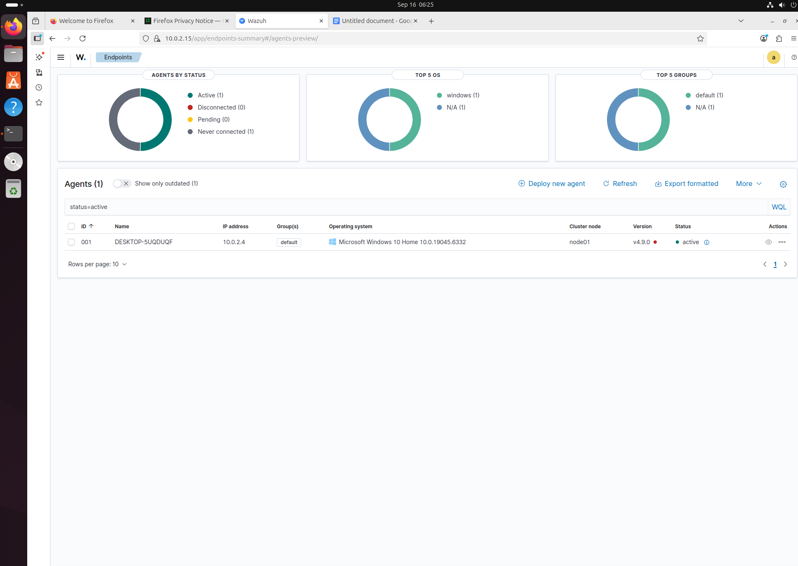  
*Agents page showing Windows 10 machine (DESKTOP-5UQDUQF) connected and active*

### Step 5: Creating Automation Scripts
I built several bash scripts to automate monitoring and testing.

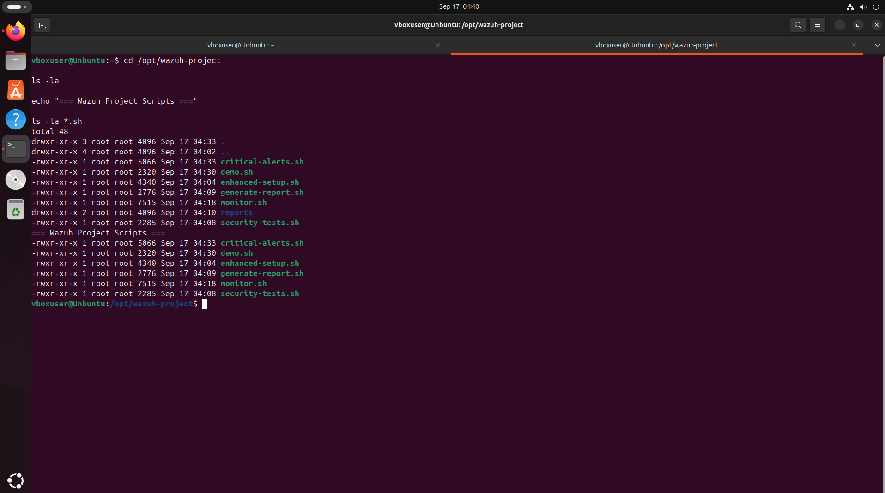  
*All my scripts organized in `/opt/wazuh-project/` directory*

  
*Detailed view of all automation scripts I created for this project*

### Step 6: Running Security Tests
I created a demo script that simulates various security events to test detection.

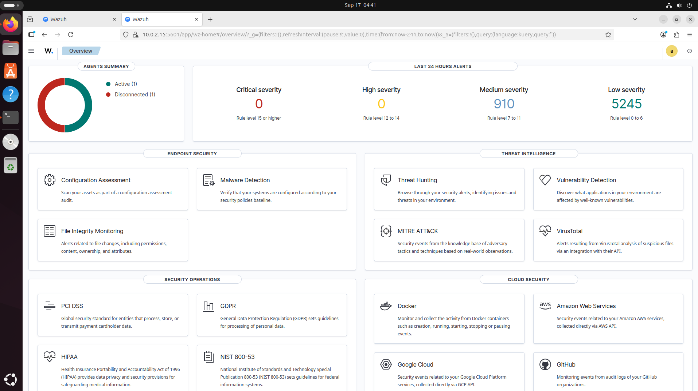  
*Running my `demo.sh` script — simulating brute force attacks and suspicious file creation*

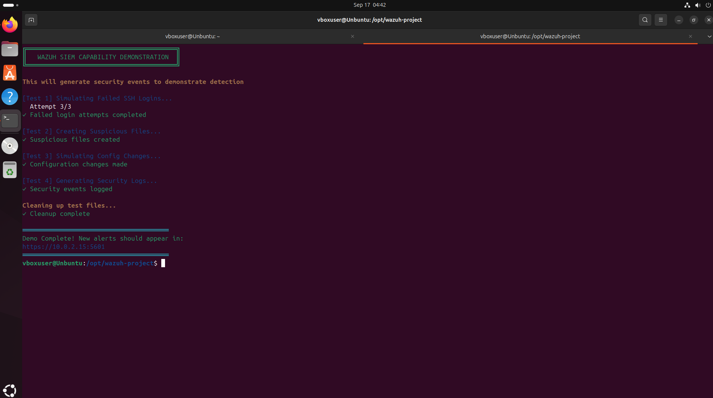  
*Demo script completed — shows what security events were generated*

### Step 7: Simulating Critical Threats
I wrote a script to generate critical security alerts like ransomware and system compromise.

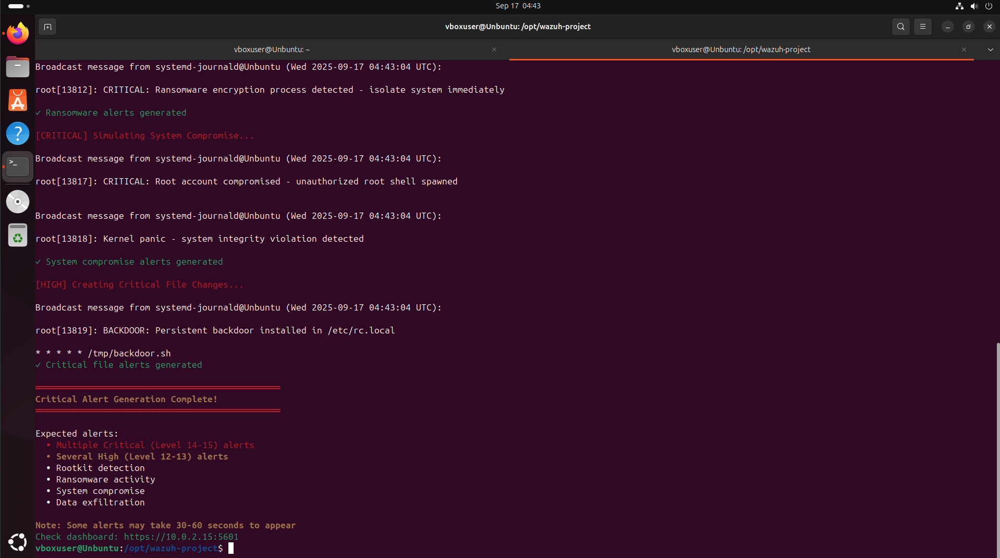  
*Running `critical-alerts.sh` script — simulating ransomware and backdoor installation*

### Step 8: Final Dashboard Status
After all testing, the dashboard showed comprehensive security monitoring.

  
*Final dashboard showing 6,155 total alerts captured (910 medium, 5,245 low severity)*

### Step 9: Network Configuration
Both virtual machines configured on the same network for communication.

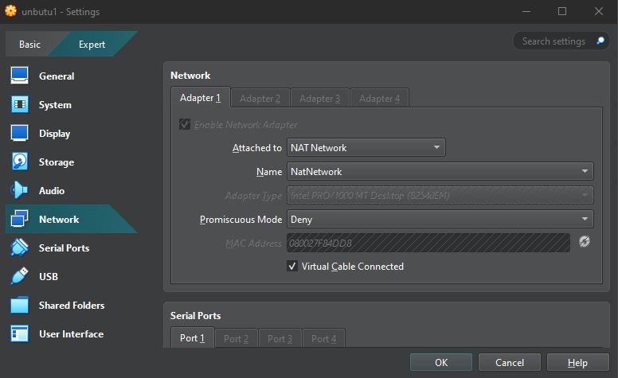  
*Ubuntu server network settings — using NAT Network at `10.0.2.15`*

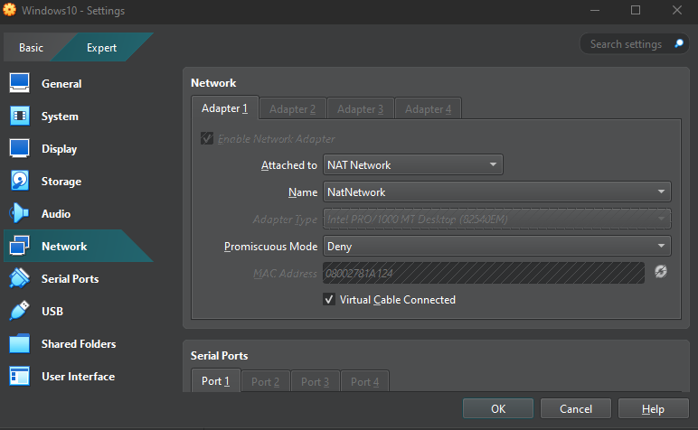  
*Windows 10 network settings — on same NAT Network at `10.0.2.4`*

---

## Code Files

### 1. Real-Time Monitoring Script (`monitor.sh`)
This script shows live security status like a Security Operations Center:

```bash
#!/bin/bash

RED='\033[0;31m'
GREEN='\033[0;32m'
YELLOW='\033[1;33m'
BLUE='\033[0;34m'
CYAN='\033[0;36m'
NC='\033[0m'

while true; do
    clear

    echo -e "${CYAN}================================${NC}"
    echo -e "${CYAN}   WAZUH SECURITY OPERATIONS    ${NC}"
    echo -e "${CYAN}================================${NC}"
    echo -e "Time: $(date '+%Y-%m-%d %H:%M:%S')\n"

    # Check if services are running
    echo -e "${YELLOW}SYSTEM STATUS${NC}"
    if systemctl is-active --quiet wazuh-manager; then
        echo -e "  Wazuh Manager: ${GREEN}ONLINE${NC}"
    else
        echo -e "  Wazuh Manager: ${RED}OFFLINE${NC}"
    fi

    # Show connected agents
    echo -e "\n${YELLOW}CONNECTED AGENTS${NC}"
    /var/ossec/bin/agent_control -l | grep Active

    # Show alert counts (from alerts.log)
    echo -e "\n${YELLOW}SECURITY ALERTS (Log Totals)${NC}"
    CRITICAL=$(grep -c 'level="1[2-5]"' /var/ossec/logs/alerts/alerts.log 2>/dev/null || echo 0)
    HIGH=$(grep -c 'level="1[0-1]"' /var/ossec/logs/alerts/alerts.log 2>/dev/null || echo 0)
    MEDIUM=$(grep -c 'level="[7-9]"' /var/ossec/logs/alerts/alerts.log 2>/dev/null || echo 0)

    echo -e "  Critical: ${RED}$CRITICAL${NC}"
    echo -e "  High: ${YELLOW}$HIGH${NC}"
    echo -e "  Medium: ${BLUE}$MEDIUM${NC}"

    sleep 5
done
```

---

### 2. Security Report Generator (`generate-report.sh`)
This script creates professional security reports automatically:

```bash
#!/bin/bash

echo "Generating Wazuh Security Report..."

REPORT_DIR="/opt/wazuh-project/reports"
mkdir -p "$REPORT_DIR"
REPORT_FILE="$REPORT_DIR/security_report_$(date +%Y%m%d_%H%M%S).txt"

cat > "$REPORT_FILE" << 'EOF'
=====================================
    WAZUH SECURITY REPORT
    Generated: $(date)
=====================================

EXECUTIVE SUMMARY
-----------------
Organization: Demo Security Operations
System: Wazuh SIEM v4.9.2

INFRASTRUCTURE
--------------
- Wazuh Manager: 10.0.2.15 (Ubuntu)
- Windows Agent: 10.0.2.4 (Windows 10)

SECURITY METRICS
----------------
Total Alerts: $(grep -c "Alert" /var/ossec/logs/alerts/alerts.log 2>/dev/null)
Authentication Events: $(grep -ci "authentication" /var/ossec/logs/alerts/alerts.log 2>/dev/null)
File Changes: $(grep -ci "syscheck" /var/ossec/logs/alerts/alerts.log 2>/dev/null)

RECOMMENDATIONS
---------------
1. Review all critical alerts
2. Update security rules
3. Check agent connectivity
4. Review firewall rules

EOF

# Post-process substitutions for embedded command results
# (Because we used a quoted heredoc to avoid variable interpolation,
# we now replace the placeholders with command outputs.)
sed -i "s|\$(date)|$(date)|" "$REPORT_FILE"
sed -i "s|\$(grep -c \"Alert\" /var/ossec/logs/alerts/alerts.log 2>/dev/null)|$(grep -c "Alert" /var/ossec/logs/alerts/alerts.log 2>/dev/null)|" "$REPORT_FILE"
sed -i "s|\$(grep -ci \"authentication\" /var/ossec/logs/alerts/alerts.log 2>/dev/null)|$(grep -ci "authentication" /var/ossec/logs/alerts/alerts.log 2>/dev/null)|" "$REPORT_FILE"
sed -i "s|\$(grep -ci \"syscheck\" /var/ossec/logs/alerts/alerts.log 2>/dev/null)|$(grep -ci "syscheck" /var/ossec/logs/alerts/alerts.log 2>/dev/null)|" "$REPORT_FILE"

echo "Report saved to: $REPORT_FILE"
```

---

### 3. Attack Simulation Script (`demo.sh`)
This script generates test security events to verify detection works:

```bash
#!/bin/bash

echo "================================"
echo "   WAZUH SECURITY DEMO          "
echo "================================"

# Test 1: Failed SSH logins
echo "[Test 1] Simulating Failed Logins..."
for i in {1..3}; do
    timeout 1 ssh invalid@localhost 2>/dev/null
done
echo "Done - Check for brute force alerts"

# Test 2: Suspicious files
echo "[Test 2] Creating Suspicious Files..."
sudo touch /tmp/malware.exe
sudo touch /tmp/backdoor.sh
echo "Done - Check for file alerts"

# Test 3: Config changes
echo "[Test 3] Making Config Changes..."
sudo touch /etc/test_file
sudo rm /etc/test_file
echo "Done - Check for system alerts"

# Test 4: Security logs
echo "[Test 4] Generating Security Events..."
logger -p auth.err "Failed authentication"
logger -p auth.crit "INTRUSION DETECTED"
echo "Done - Check dashboard"

# Cleanup
sudo rm -f /tmp/malware.exe /tmp/backdoor.sh

echo "Demo complete!"
```

---

## How to Run This Project

### Requirements
- VirtualBox installed  
- Ubuntu Server VM (for Wazuh manager)  
- Windows 10 VM (for agent)  
- Both VMs on same **NAT Network**  
- At least **4GB RAM** for Ubuntu, **2GB** for Windows  

### Setup Instructions

**1) Install Wazuh on Ubuntu:**
```bash
curl -sO https://packages.wazuh.com/4.9/wazuh-install.sh
sudo bash wazuh-install.sh -a
```

**2) Configure Network:**
- Set both VMs to **NAT Network** in VirtualBox settings.

**3) Install Windows Agent:**
- Download agent from the Wazuh dashboard and install on Windows 10.

**4) Run Monitoring:**
```bash
sudo /opt/wazuh-project/monitor.sh
```

**5) Generate Test Events:**
```bash
sudo /opt/wazuh-project/demo.sh
```

**6) Create Report:**
```bash
sudo /opt/wazuh-project/generate-report.sh
```

---

## Results and Findings

**What I Achieved**
- Successfully deployed enterprise SIEM system  
- Captured **6,155** security events  
- Detected **910** medium severity threats  
- Monitored both Linux and Windows systems  
- Created automated monitoring tools  
- Built professional reporting system  

**Security Capabilities Implemented**
- File Integrity Monitoring (**755** file changes detected)  
- Authentication tracking (**67** successful logins)  
- Malware detection (**18** indicators found)  
- Real-time threat alerting  
- Compliance monitoring (PCI DSS, GDPR, HIPAA)  
- Automated incident response  

---

## What I Learned
- How to deploy enterprise security monitoring systems  
- The importance of centralized log management  
- How to write automation scripts for security operations  
- How to analyze security events and identify threats  
- The value of real-time monitoring for incident response  
- How to create professional security reports  

---

## Skills Demonstrated
- SIEM deployment and configuration  
- Cross-platform system administration (Linux and Windows)  
- Bash scripting and automation  
- Security event analysis  
- Network configuration and troubleshooting  
- Security reporting  

---

## Contact
Feel free to reach out if you have questions about this project or want to discuss cybersecurity!
