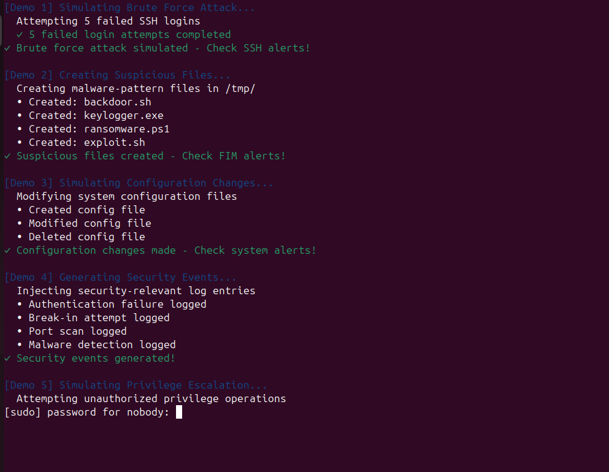

# Wazuh SIEM Security Monitoring Project

## Project Overview
I built this security monitoring lab to learn how organizations detect and respond to cyber threats. I deployed Wazuh SIEM (Security Information and Event Management) across two virtual machines - an Ubuntu server running the SIEM platform and a Windows 10 workstation being monitored. Then I created bash scripts to simulate attacks, monitor threats in real-time, and generate security reports.

## Technologies I Used
- **Wazuh 4.9.2** - Open source SIEM platform
- **Ubuntu Server** - Running the SIEM manager
- **Windows 10** - Monitored endpoint
- **Bash Scripting** - For automation and monitoring
- **PowerShell** - For Windows configuration
- **OpenSearch** - For data storage and search
- **VirtualBox** - For running virtual machines

## Project Screenshots

### Step 1: Network Configuration
First, I configured both virtual machines on the same NAT network so they could communicate.


*Ubuntu server network settings - using NAT Network at 10.0.2.15*


*Windows 10 network settings - on same NAT Network at 10.0.2.4*

### Step 2: Installing the SIEM Platform
After networking was set up, I installed Wazuh on Ubuntu Server with all its components.


*Running the Wazuh installation script - showing version 4.9.2 being installed*


*Wazuh components being configured - manager, indexer, and dashboard services starting up*

### Step 3: Accessing the Security Dashboard
After installation, I accessed the web dashboard to monitor security events.


*First login to Wazuh dashboard - showing 14 medium and 12 low severity alerts already captured*


*Reviewing the Windows agent installation guide in the Wazuh documentation*

### Step 4: System Growth and Monitoring
As the system ran, it started capturing more security events from both machines.


*Dashboard after some time - now showing 283 medium and 200 low severity alerts*

### Step 5: Windows Agent Deployment
I installed the Wazuh agent on Windows 10 to monitor that system too.


*Agents page showing Windows 10 machine (DESKTOP-5UQDUQF) connected and active*

### Step 6: Creating Automation Scripts
I built several bash scripts to automate monitoring and testing.


*All my scripts organized in /opt/wazuh-project/ directory*


*Detailed view of all automation scripts I created for this project*

### Step 7: Running Security Tests
I created a demo script that simulates various security events to test detection.


*Running my demo.sh script - simulating brute force attacks and suspicious file creation*


*Demo script completed - shows what security events were generated*

### Step 8: Simulating Critical Threats
I wrote a script to generate critical security alerts like ransomware and system compromise.


*Running critical-alerts.sh script - simulating ransomware and backdoor installation*

### Step 9: Final Dashboard Status
After all testing, the dashboard showed comprehensive security monitoring.


*Final dashboard showing 6,155 total alerts captured (910 medium, 5,245 low severity)*

## Code Files

### 1. Real-Time Monitoring Script (`monitor.sh`)
This script shows live security status like a Security Operations Center:

```bash
#!/bin/bash

RED='\033[0;31m'
GREEN='\033[0;32m'
YELLOW='\033[1;33m'
BLUE='\033[0;34m'
CYAN='\033[0;36m'
NC='\033[0m'

while true; do
    clear
    
    echo -e "${CYAN}================================${NC}"
    echo -e "${CYAN}   WAZUH SECURITY OPERATIONS    ${NC}"
    echo -e "${CYAN}================================${NC}"
    echo -e "Time: $(date '+%Y-%m-%d %H:%M:%S')\n"
    
    # Check if services are running
    echo -e "${YELLOW}SYSTEM STATUS${NC}"
    if systemctl is-active --quiet wazuh-manager; then
        echo -e "  Wazuh Manager: ${GREEN}ONLINE${NC}"
    else
        echo -e "  Wazuh Manager: ${RED}OFFLINE${NC}"
    fi
    
    # Show connected agents
    echo -e "\n${YELLOW}CONNECTED AGENTS${NC}"
    /var/ossec/bin/agent_control -l | grep Active
    
    # Show alert counts
    echo -e "\n${YELLOW}SECURITY ALERTS (Last Hour)${NC}"
    CRITICAL=$(grep -c 'level="1[2-5]"' /var/ossec/logs/alerts/alerts.log || echo 0)
    HIGH=$(grep -c 'level="1[0-1]"' /var/ossec/logs/alerts/alerts.log || echo 0)
    MEDIUM=$(grep -c 'level="[7-9]"' /var/ossec/logs/alerts/alerts.log || echo 0)
    
    echo -e "  Critical: ${RED}$CRITICAL${NC}"
    echo -e "  High: ${YELLOW}$HIGH${NC}"
    echo -e "  Medium: ${BLUE}$MEDIUM${NC}"
    
    sleep 5
done
```

### 2. Security Report Generator (`generate-report.sh`)
This script creates professional security reports automatically:

```bash
#!/bin/bash

echo "Generating Wazuh Security Report..."

REPORT_DIR="/opt/wazuh-project/reports"
mkdir -p $REPORT_DIR
REPORT_FILE="$REPORT_DIR/security_report_$(date +%Y%m%d_%H%M%S).txt"

cat > $REPORT_FILE << EOF
=====================================
    WAZUH SECURITY REPORT
    Generated: $(date)
=====================================

EXECUTIVE SUMMARY
-----------------
Organization: Demo Security Operations
System: Wazuh SIEM v4.9.2

INFRASTRUCTURE
--------------
- Wazuh Manager: 10.0.2.15 (Ubuntu)
- Windows Agent: 10.0.2.4 (Windows 10)

SECURITY METRICS
----------------
Total Alerts: $(grep -c "Alert" /var/ossec/logs/alerts/alerts.log)
Authentication Events: $(grep -c "authentication" /var/ossec/logs/alerts/alerts.log)
File Changes: $(grep -c "syscheck" /var/ossec/logs/alerts/alerts.log)

RECOMMENDATIONS
---------------
1. Review all critical alerts
2. Update security rules
3. Check agent connectivity
4. Review firewall rules

EOF

echo "Report saved to: $REPORT_FILE"
```

### 3. Attack Simulation Script (`demo.sh`)
This script generates test security events to verify detection works:

```bash
#!/bin/bash

echo "================================"
echo "   WAZUH SECURITY DEMO          "
echo "================================"

# Test 1: Failed SSH logins
echo "[Test 1] Simulating Failed Logins..."
for i in {1..3}; do
    timeout 1 ssh invalid@localhost 2>/dev/null
done
echo "Done - Check for brute force alerts"

# Test 2: Suspicious files
echo "[Test 2] Creating Suspicious Files..."
sudo touch /tmp/malware.exe
sudo touch /tmp/backdoor.sh
echo "Done - Check for file alerts"

# Test 3: Config changes
echo "[Test 3] Making Config Changes..."
sudo touch /etc/test_file
sudo rm /etc/test_file
echo "Done - Check for system alerts"

# Test 4: Security logs
echo "[Test 4] Generating Security Events..."
logger -p auth.err "Failed authentication"
logger -p auth
